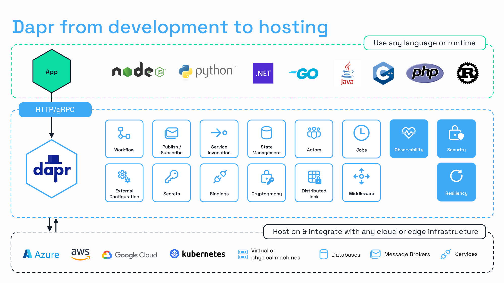

# Dapr Workshop

Welcome to Diagrid's [Dapr](https://dapr.io/) Workshop! This repository contains a set of hands-on challenges designed to introduce you to Dapr's most popular APIs and give you a starting point to build your own distributed applications.

Microservices architectures are popular for a variety of reasons - they enable polyglot development, are easily scaled, and perform simple, focused tasks. However, as the number of microservices grows, so does the complexity of the system. Managing security, observability, and resiliency becomes increasingly challenging, often leading to the same problems being solved over and over again.

Dapr addresses these challenges by providing a set of APIs for building distributed systems with best practices for microservices baked in. Leveraging Dapr allows you to reduce development time while building reliable, observable, and secure distributed applications with ease. Let’s dive in and explore how Dapr can simplify your journey to distributed systems excellence!

## Goals

On completion of this workshop, you will understand how three of the most popular Dapr Building Block APIs work: [State Management](https://docs.dapr.io/developing-applications/building-blocks/state-management/), [Service Invocation](https://docs.dapr.io/developing-applications/building-blocks/service-invocation/), and [Publish/Subscribe](https://docs.dapr.io/developing-applications/building-blocks/pubsub/).

You will build three microservices to simulate the process of ordering a pizza:

- The `pizza-store` service orchestrates the entire process of the pizza ordering, cooking and delivery. It interacts with the other services to ensure they are completing their tasks.
- The `pizza-kitchen` service has a single responsibility, to cook the pizza.
- The `pizza-delivery` service manages the delivery process, from picking up the pizza at the kitchen to delivering it to the customer's doorstep.

## Challenges

### Challenge 1: State Management

You will start the workshop by creating the `pizza-store` service. It's responsible for creating a new pizza order and saving it to a Redis database, using the [Dapr State Management Building Block](https://docs.dapr.io/developing-applications/building-blocks/state-management/). You will learn how to create a Dapr Component specification, and how to use the Dapr SDK to save and retrieve an item using the State Store API.

### Challenge 2: Service Invocation

This challenge will focus on synchronous communication between two services using the [Dapr Service Invocation Building Block](https://docs.dapr.io/developing-applications/building-blocks/service-invocation/). After the pizza order is saved in the database, you will create another service responsible for cooking the pizza - the `pizza-kitchen` service. This service will have an endpoint that will be invoked directly from the `pizza-store` service.

### Challenge 3: Pub/Sub

In the final challenge, you will create your third service, `pizza-delivery`. You will use the [Dapr Publish & Subscribe Building Block](https://docs.dapr.io/developing-applications/building-blocks/pubsub/) to publish events to a Redis Streams message broker. These events represent each stage in the pizza order and delivery process. For every event published, the `pizza-store` service will subscribe to it and update the current order status in the Redis State Store.

## Get started

No existing knowledge of Dapr or microservices is needed to complete this workshop but basic programming skills for your language of choice are required.
Today this workshop offers challenges in .NET and Python. Complete the [technical prerequisites](./docs/prerequisites.md) and start the first challenge!
